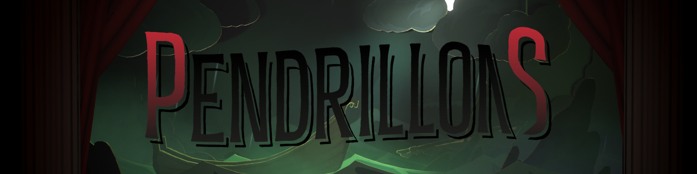
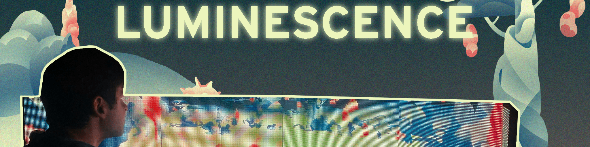

# About Me 

#### Hi 👋, I'm Théo(phile) Carrasco !

I am a game developper student at [ENJMIN](https://enjmin.cnam.fr/enjmin/ecole-nationale-du-jeu-et-des-medias-interactifs-accueil-1126103.kjsp) !
I enjoy learn how games work behind the scene !

## Projects

### **They Make Sound**

Currently working on **They Make Sound** - M2 project
A third person game about speleology and exploration where you way down a giant pit filled with the ruins of an antique civilization. The goal is to produce a vertical slice, it is made by 10 people as second year project of the Master's degree at ENJMIN. 

**They Make Sound** is made with **Unreal Engine**.

---

### **Pendrillons** - M1 ENJMIN project

Pendrillons is a micro RPG that takes place in a play. Act out your role, choose your lines and actions, and engage in turn-based combat to influence the course of the show. But beware: an audience is watching the performance, and reacting to your every move!

It was created by 5 people in 3 months as an end-of-year project in the first year of the Master's degree at ENJMIN.

**Pendrillons** was made in Unity.

---

### [**Engine Programming**](https://github.com/EyeCrown/Engine_Programming)

A 3D game engine project. The engine is developped in C++ using **OpenGL** and the goal is to recreate a minecraft like environment. It integrate procedural world generation, vertex/geometry/fragment shading, FPS movements...

---

#### [**Game Boy Game developpement**](https://github.com/EyeCrown/GB_TopDownGame)

This is a tiny game for GameBoy Classic DMG. It's a dungeon crawler where you play a knight fighting monster to reach a tresor deep in the dungeon. This game is developed fully in assembly code **gbz80**.

---

#### [**Arakne**](https://github.com/EyeCrown/Arakne)

A shoot 'em up game that offers a cooperative and strategic experience, where light challenges darkness. Made by 11 people team on 4 full-days work as Nano project at ENJMIN using Unity.

---

#### [**Luminescence**](https://github.com/EyeCrown/Luminescence)

Luminescence is a walking simulator on an alien planet displayed on four LED panels instead of a screen. This game was made in 3 and a half day during the Alternative Output Workshop at ENJMIN 2023. The objective was to create a game where the output wouldn't be a regular computer screen by using Unity.

---

#### **Projet C++** - Plants Vs. Zombies in terminal
A simplified Plants Vs. Zombies for Windows terminal using ASCII characters, made fully in C++ in duo at ENJMIN.

## Tech Stack

### Game Engine

### Languages

### Versioning

### IDEs

---

<!--
**EyeCrown/EyeCrown** is a ✨ _special_ ✨ repository because its `README.md` (this file) appears on your GitHub profile.

Here are some ideas to get you started:

- 🔭 I’m currently working on ...
- 🌱 I’m currently learning ...
- 👯 I’m looking to collaborate on ...
- 🤔 I’m looking for help with ...
- 💬 Ask me about ...
- 📫 How to reach me: ...
- 😄 Pronouns: ...
- ⚡ Fun fact: ...
-->