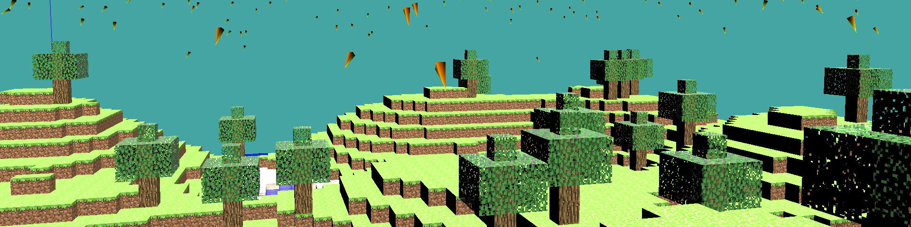

# About Me 

#### Hi 👋, I'm Théo(phile) Carrasco !

I am a **Game Developer** student in 2nd year master's degree at [**ENJMIN**](https://enjmin.cnam.fr/enjmin/ecole-nationale-du-jeu-et-des-medias-interactifs-accueil-1126103.kjsp) 
with a passion for bringing immersive experiences to life through code, design, and creativity !
My goal is to <!--specialize in Engine Programming, contributing--> contribute to the technology that powers games and interactive experiences. 

I'm also taking an interest in developing retro games, in particular by learning how to develop games for the classic Game Boy.

<!--[](LINK FOR CV EN-->

## Projects

### Current Project - **They Make Sound**

An exploration and speleology game where you play an archaeologist descending into the immense abyss to study
the ruins of an extinct civilization.
Equipped with a device capable of hearing sounds emitted thousands of years ago, you must make your way ever deeper into
the abyss in order to unravel the secrets of this mysterious civilization.

A journey of no return...

**They Make Sound** is made with **Unreal Engine**, using **Blueprint** & **C++**.

- Develop game systems 
- Work on camera
- Ensure optimization

---

### [**Pendrillons**](https://github.com/EyeCrown/Pendrillons) - M1 ENJMIN end-of-year project

**Pendrillons** is a **micro RPG** that takes place in a play. Act out your role, choose your lines and actions, and engage in **turn-based** combat to influence the course of the show. But beware: an audience is **watching** the performance and **reacting** to your every move!

It was created by 5 people in 3 months as an end-of-year project in the first year of the Master's degree at ENJMIN.

**Pendrillons** was made in **Unity**.

---

### [**Engine Programming**](https://github.com/EyeCrown/Engine_Programming)

A 3D game engine project. The engine is developed in C++ using **OpenGL**, and the goal was to recreate a Minecraft-like environment. It integrates procedural world generation, vertex/geometry/fragment shading, FPS movements...

---

#### [**Game Boy Game developpement**](https://github.com/EyeCrown/GB_TopDownGame)

This is a tiny game for Game Boy Classic DMG. It's a dungeon crawler where you play a knight fighting monsters to reach a treasure deep in the dungeon. This game is developed in **assembly code GBZ80**.

---

#### [**Arakne**](https://github.com/EyeCrown/Arakne)

A shoot 'em up game that offers a cooperative and strategic experience, where light challenges darkness. Made by 11 people team on 4 full-days work as Nano project at ENJMIN using **Unity**.

---

#### [**Luminescence**](https://github.com/EyeCrown/Luminescence)

Luminescence is a walking simulator on an alien planet displayed on four LED panels instead of a screen. This game was made in 3 and a half day during the Alternative Output Workshop at ENJMIN 2023. The objective was to create a game where the output wouldn't be a regular computer screen by using **Unity**.

---
<!--
#### **Projet C++** - Plants vs. Zombies in terminal
A simplified Plants s. Zombies for Windows terminal using ASCII characters, made fully in C++ in duo at ENJMIN.
-->
## Tech Stack

### Game Engine

### Languages

### Versioning

### IDEs

---

<!--
**EyeCrown/EyeCrown** is a ✨ _special_ ✨ repository because its `README.md` (this file) appears on your GitHub profile.

Here are some ideas to get you started:

- 🔭 I’m currently working on **They Make Sound** (more details below)
- 🌱 I’m currently learning ...
- 👯 I’m looking to collaborate on ...
- 🤔 I’m looking for help with ...
- 💬 Ask me about ...
- 📫 How to reach me: ...
- 😄 Pronouns: ...
- ⚡ Fun fact: ...

-->